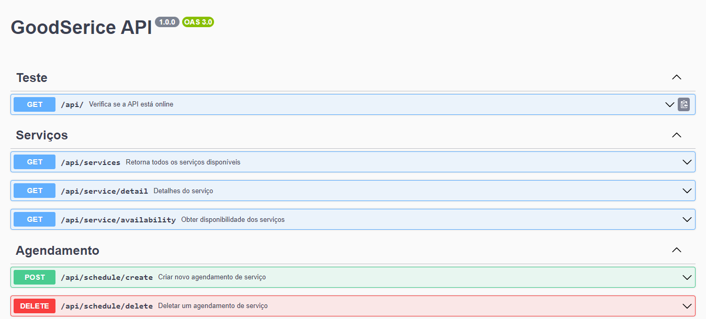
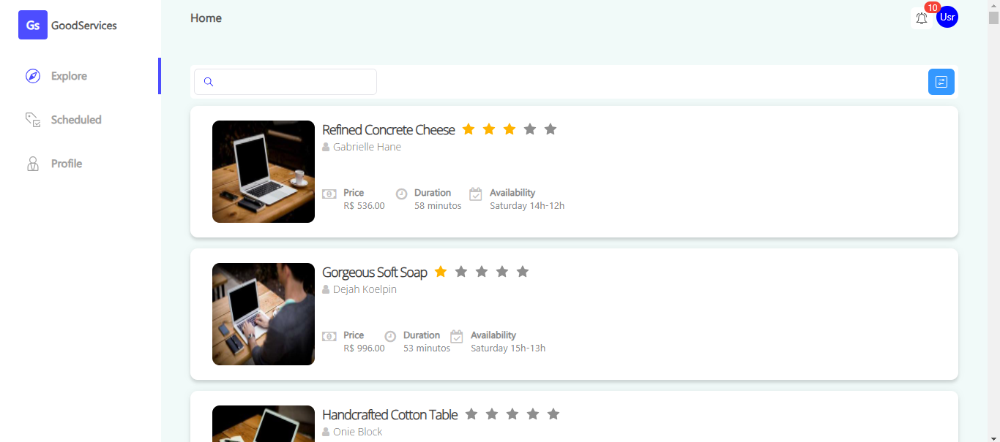
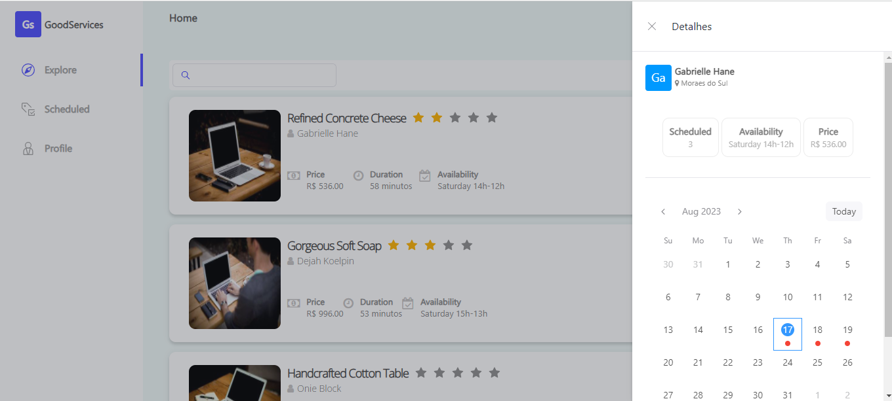
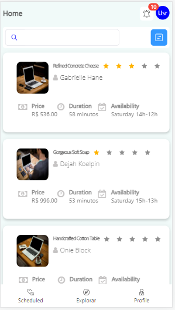

# GoodService-API





## Descrição

Este projeto é uma API para gerenciamento e agendamento de serviços.

## Pré-requisitos

Para executar este projeto, você precisa ter:

- Node.js
- npm

## Instalação

1. Clone o repositório para sua máquina local:
```bash
git clone <URL_do_repositorio>
```

2. Entre no diretório do projeto:
```bash
cd GoodServiceApi
```

3. Instale as dependências do projeto:
```bash
npm install
```


## Configuração

1. Execulte as migrações para que o banco de dados seja criado no diretorio /db/database.sqlite

```bash
sequelize db:migrate
```

2. Semeie os dados no banco com o service.json que esta em /data/services.json

```bash
sequelize db:seed:all
```


## Execução

Para executar o projeto em modo de desenvolvimento, execute o seguinte comando:

```bash
nodemon index.js
```

O projeto será executado na porta especificada no arquivo de configuração.

## Rotas e Métodos

### Rotas no arquivo `apiRoutes.js`:

1. `GET /docs/`: Interfaçe do swagger para testar a api.
1. `GET /api/`: Verifica se a API está online.
2. `GET /api/services`: Retorna todos os serviços disponíveis.
3. `GET /api/service/detail`: Retorna detalhes de um serviço específico, usando o parâmetro de consulta `id`.

### Rotas no arquivo `scheduleRoutes.js`:

1. `GET /api/schedule/all`: Retorna todos os serviços agendados.
2. `GET /api/schedule/filter`: Filtra os serviços agendados por ID de serviço, usando o parâmetro de consulta `service_id`.

## Estrutura de Diretórios e Arquivos

- `index.js`: Arquivo principal da aplicação.
- `migrations`: Diretório contendo arquivos de migração do banco de dados.
- `package.json`: Este arquivo contém informações sobre o projeto e suas dependências.
- `.sequelizerc`: Arquivo de configuração do Sequelize.
- `docs`: Diretório contendo a documentação do projeto.
- `config`: Diretório contendo arquivos de configuração do projeto.
- `src`: Diretório contendo os arquivos fonte do projeto.

##Link de acesso
 https://good-service.onrender.com/docs/

# GoodService - Front-End









## Descrição

O Projeto GoodService e uma aplicação web para listar e servições e fazer agendamentos.

## Pré-requisitos

Para executar este projeto, você precisa ter:

- Node.js
- npm

## Instalação

1. Clone o repositório para sua máquina local:
```bash
git clone <URL_do_repositorio>
```

2. Entre no diretório do projeto:
```bash
cd GoodService
```

3. Instale as dependências do projeto:
```bash
npm install
```


## Conexão com o back-end

1. No arquivo GoodService/src/utils/api.js coloque a ip do backend no axios.create

```javascript
const api = axios.create({
baseURL:<Seu_ip_aqui>,
timeout: 10000,
headers: {
'Content-Type': 'application/json',
},
});
```


## Execução

Para executar o projeto em modo de desenvolvimento, execute o seguinte comando:

```bash
npm run dev
```


## Estrutura de Diretórios e Arquivos

- `README.md`: Este arquivo contém informações sobre o projeto e instruções de uso.
- `index.html`: Página principal do projeto.
- `package.json`: Este arquivo contém informações sobre o projeto e suas dependências.
- `vite.config.js`: Arquivo de configuração do Vite.
- `public`: Diretório contendo arquivos públicos do projeto.
- `src`: Diretório contendo os arquivos fonte do projeto.
- `.gitignore`: Arquivo que especifica quais arquivos devem ser ignorados pelo Git.
- `.eslintrc.cjs`: Arquivo de configuração do ESLint.

##Link de acesso
 https://good-service.vercel.app/

## Contribuição

Se você deseja contribuir para este projeto, siga estas etapas:

1. Faça um fork do repositório.
2. Crie uma nova branch para sua contribuição.
3. Faça suas alterações.
4. Envie um pull request.

## Licença

Este projeto está licenciado sob a licença MIT.

## Contato

Para obter mais informações, entre em contato com o mantenedor do projeto em <railsonp560@gmail.com>.
